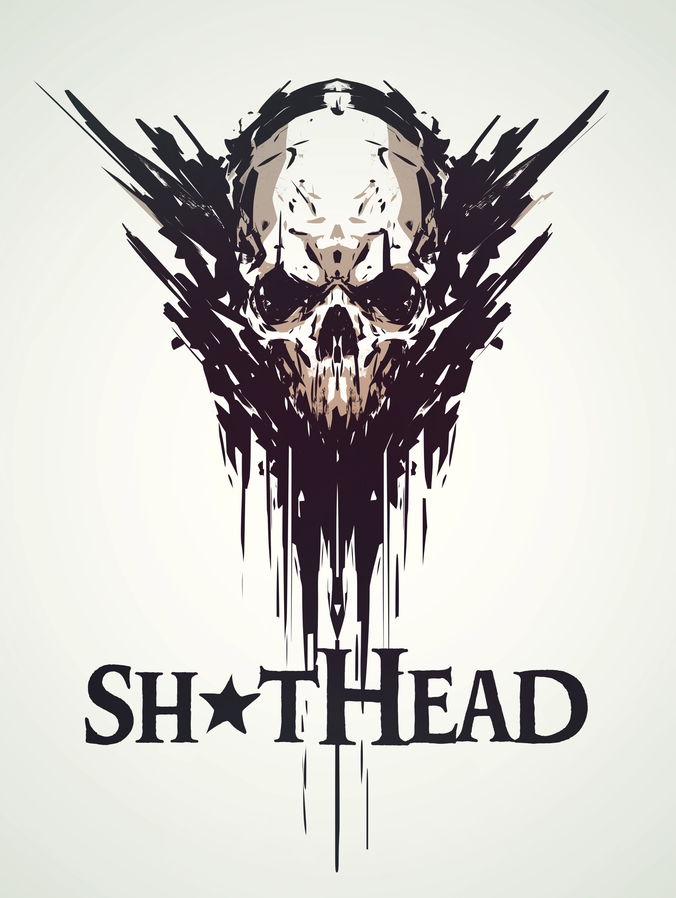

# Sh*tHead

Sh*tHead is a javascript recreation of the popular card game "Shithead".
Users are able to play against a computer opponent.

## The game will use the following rules:

- The deck will be shuffled and each player gets delt 1 card each until the both have 3 cards face down, 3 cards face up, and 3 to their hand.
- Player must play a higher card than last played unless it's a special card
- If you can't play a higher card then you must pick up the deck
- You must have a minimum of 3 cards in your hand until the deck is empty
- Once your hand is empty then you can play one of the 6 table cards you have (3 face down, 3 face up) using the face up cards first
- Before you start game you can swap your face up cards for cards you have in your hand if you wish
- If you have more than one card of the same value you may play them at the same time.
- If 4 cards of the same value are played in a row then the current pack gets burned and taken out of play.
- Aces are High & Low.
### Special cards:
- 2 - Can be played on any card
- 5 - Can be played on any card, must be followed by a lower card.
- 7 - Can be played on any card, next player skips a go.
- 8 - Can be played on any card, is invisible (Next player must play game from previous card)
- 10 - Can be played on any card, burns the pack and allows player to play another card.

### Credits:
Play card images - https://tekeye.uk/playing_cards/svg-playing-cards